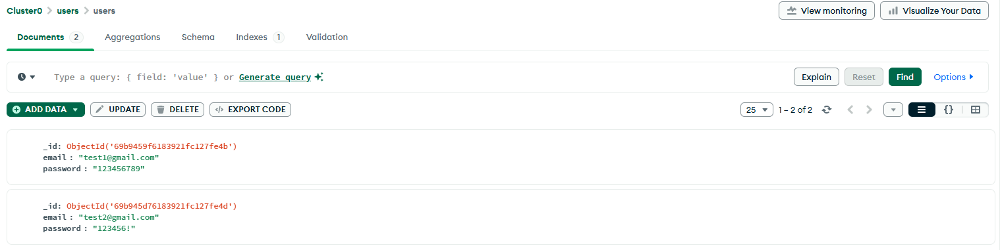
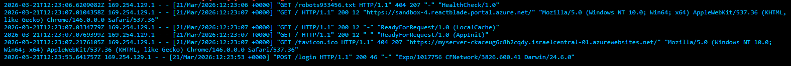
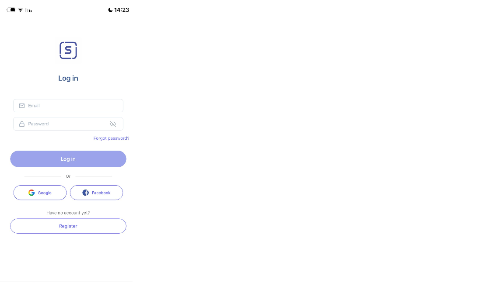
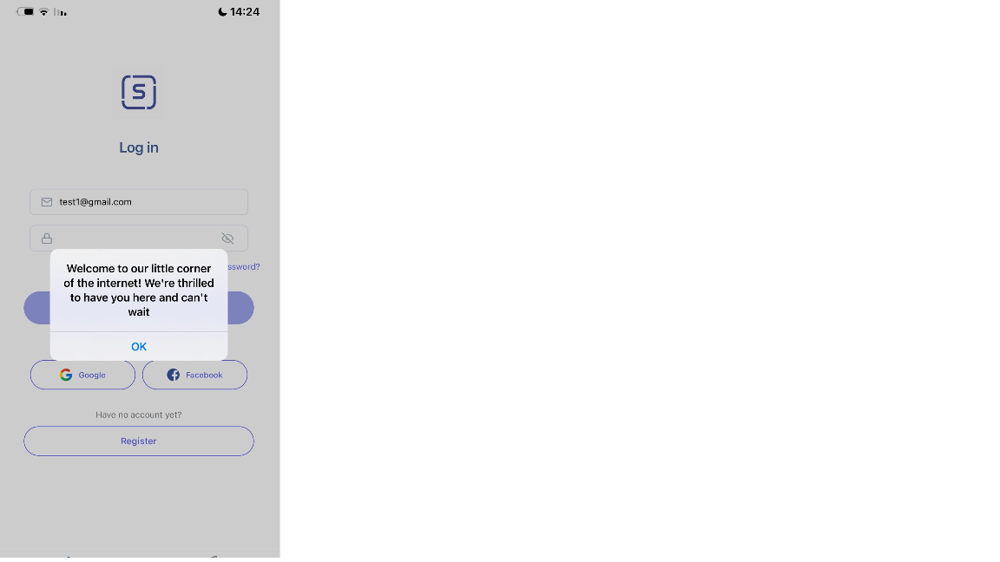
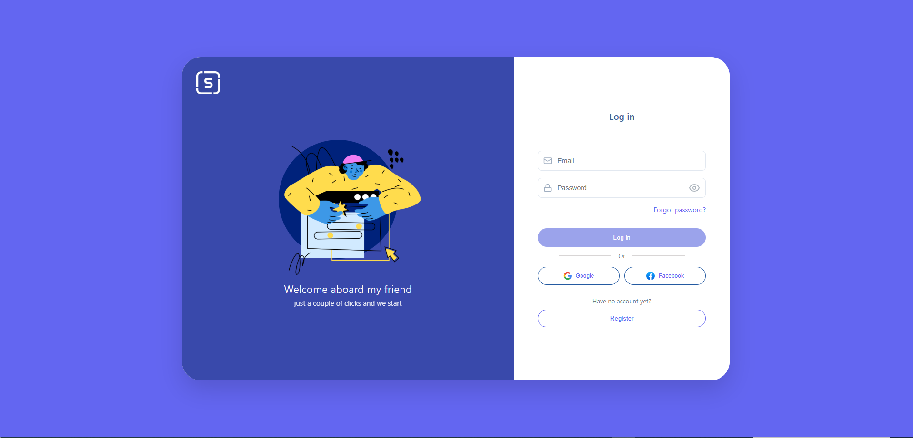
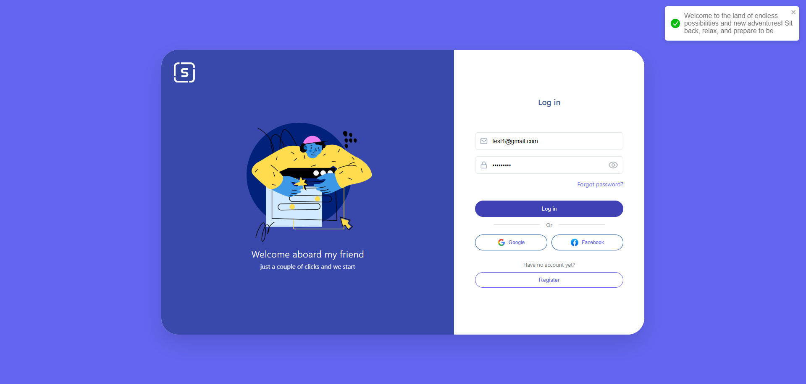
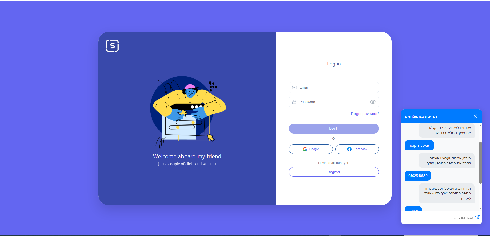

# -HomeTest-ElysianSoftech
For the App interface (React Native) 
Backend:
The server using python run on Azure cloud in the link: 
the seconed server written in NodeJS is local.

follow these steps to run NodeJS server locally:

cd NodeServer
npm install

locate the file named .env.example in the server directory
rename this file to .env, open it and insert your private API key
start the server by: node server.js

Frontend:
i use the platform of Expo App

npm install
note: In the code (specifically in the API call section), you will find the following line:
const Response_node = await axios.get('http://192.168.1.35:5000/get-message'); you need to ensure that the IP address matches the local your IP address/

npx expo start

screenshots:
MongoDB:

log from Azure:

app:

For the Web interface (ReactJS)
Backend:
ensure the Node server is still running

Frontend:
navigate to the folder web

npm start

screenshots:

chatbot:
the prompt:
"i need to add a friendly AI agent in Hebrew, which provides customer service (package status) and sales support (encouraging customers to order more deliveries). The agent must act as a charming, generous, and professional customer service representative and ask for name, phone and order number. The agent must run on website - Figma page that i built before. All conversations must be logged into an Excel, including: Caller’s name Phone number Conversation details. Show me the entire from the start and  running the code in the terminal." - usign Gemini

pip install openai openpyxl flask flask-cors python-dotenv
pip install pandas openpyxl

python app.py

screenshot:
